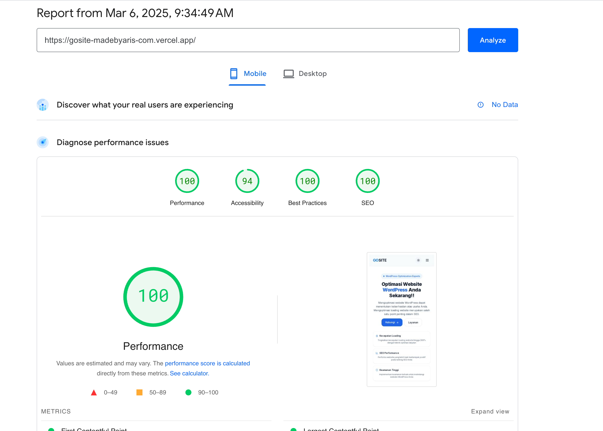

# 🚀 MadeByAris.com - Modern Portfolio & Blog Platform

<div align="center">
  
  <p><em>A high-performance, SEO-optimized portfolio and blog platform built with Next.js 15</em></p>
  
  [](https://nextjs.org/)
  [](https://www.typescriptlang.org/)
  [](https://tailwindcss.com/)
  [](https://developer.wordpress.org/rest-api/)
  [](LICENSE)
</div>

## ✨ Overview

MadeByAris.com is a modern, high-performance portfolio and blog platform designed for developers, designers, and creative professionals. It combines the power of Next.js 15 with WordPress as a headless CMS, delivering lightning-fast performance, stunning visuals, and exceptional SEO capabilities.

### 🌟 [Live Demo](https://gosite-madebyaris-com.vercel.app/)



## 📋 Table of Contents

- [Features](#-features)
- [Tech Stack](#-tech-stack)
- [Performance Optimizations](#-performance-optimizations)
- [Getting Started](#-getting-started)
  - [Prerequisites](#prerequisites)
  - [Installation](#installation)
  - [Environment Setup](#environment-setup)
- [Project Structure](#-project-structure)
- [Content Management](#-content-management)
- [Deployment](#-deployment)
- [API Integration](#-api-integration)
- [Performance Monitoring](#-performance-monitoring)
- [Contributing](#-contributing)
- [License](#-license)
- [Contact](#-contact)
- [Acknowledgments](#-acknowledgments)

## 🌟 Features

### 🎨 User Interface & Design
- **Adaptive Theming**: Dark/light mode with system preference detection
- **Dynamic Animations**: Aurora background effects, sparkles, and micro-interactions
- **Responsive Design**: Flawless experience across all devices and screen sizes
- **Accessibility**: WCAG 2.1 AA compliant with keyboard navigation and screen reader support
- **Custom UI Components**: Built with Radix UI primitives and Shadcn UI

### ⚡ Performance
- **Next.js App Router**: Leveraging the latest Next.js 15 features
- **Streaming SSR**: Progressive rendering with React Suspense
- **Image Optimization**: Automatic WebP/AVIF conversion and responsive sizing
- **Font Optimization**: Self-hosted with preload and variable font support
- **Code Splitting**: Automatic chunk optimization and dynamic imports
- **Core Web Vitals**: Optimized for LCP, FID, CLS, and INP metrics

### 📱 Blog & Content Features
- **WordPress Integration**: Headless CMS with REST API
- **Rich Content**: Support for code blocks, images, embeds, and more
- **Search Functionality**: Fast, client-side search with debounced queries
- **Pagination**: Efficient content navigation with SEO-friendly URLs
- **Categories & Tags**: Content organization and filtering
- **Related Posts**: Smart content recommendations
- **Reading Time**: Automatic calculation based on content length

### 🔍 SEO & Marketing
- **SEO Optimization**: Meta tags, structured data, and semantic HTML
- **Open Graph**: Rich social media previews with dynamic images
- **Sitemap Generation**: Automatic XML sitemap creation
- **RSS Feed**: Syndication support for content distribution
- **Analytics Integration**: Ready for Google Analytics, Plausible, or Fathom
- **Structured Data**: JSON-LD implementation for rich search results

## 🛠️ Tech Stack

### Frontend
- **Framework**: [Next.js 15](https://nextjs.org/) (App Router)
- **Language**: [TypeScript](https://www.typescriptlang.org/)
- **Styling**: [Tailwind CSS](https://tailwindcss.com/) + [Tailwind Animate](https://github.com/jamiebuilds/tailwindcss-animate)
- **UI Components**: [Radix UI](https://www.radix-ui.com/) + [Shadcn UI](https://ui.shadcn.com/)
- **Animations**: [Framer Motion](https://www.framer.com/motion/)
- **Icons**: [Lucide Icons](https://lucide.dev/)
- **Fonts**: [Geist](https://vercel.com/font) + [Plus Jakarta Sans](https://fonts.google.com/specimen/Plus+Jakarta+Sans)

### Backend & APIs
- **CMS**: [WordPress REST API](https://developer.wordpress.org/rest-api/)
- **Email**: [Resend](https://resend.com/)
- **Form Handling**: Server Actions with validation
- **Authentication**: [NextAuth.js](https://next-auth.js.org/) (optional)

### DevOps & Tooling
- **Package Manager**: [pnpm](https://pnpm.io/)
- **Linting**: [ESLint](https://eslint.org/) with custom configuration
- **Formatting**: [Prettier](https://prettier.io/)
- **Git Hooks**: [Husky](https://typicode.github.io/husky/) + [lint-staged](https://github.com/okonet/lint-staged)
- **CI/CD**: GitHub Actions workflow

## 🚀 Performance Optimizations

This project implements numerous performance optimizations:

### Server-Side Optimizations
- **Incremental Static Regeneration (ISR)**: Pages are statically generated at build time and revalidated after a specified period
- **Edge Runtime**: Certain API routes run at the edge for minimal latency
- **Streaming**: Content is streamed to the client as it becomes available
- **Cache Tags**: Granular cache invalidation with on-demand revalidation
- **Middleware**: Efficient request handling and redirects

### Client-Side Optimizations
- **Bundle Analysis**: Regular monitoring of bundle size with `@next/bundle-analyzer`
- **Code Splitting**: Automatic and manual code splitting for optimal loading
- **Prefetching**: Intelligent link prefetching for instant page transitions
- **Image Lazy Loading**: Images load only when they enter the viewport
- **Web Vitals Tracking**: Monitoring of Core Web Vitals in production

## 🚦 Getting Started

### Prerequisites
- Node.js v20+ 
- pnpm v9.15.3+
- WordPress instance with REST API enabled (for blog functionality)

### Installation

```bash
# Clone the repository
git clone https://github.com/madebyaris/madebyaris.com.git
cd madebyaris.com

# Install dependencies
pnpm install

# Start development server
pnpm dev
```

### Environment Setup

Create a `.env.local` file in the root directory with the following variables:

```bash
# WordPress API
NEXT_PUBLIC_WP_API_URL="https://your-wordpress-api.com/wp-json"

# Email (Resend)
RESEND_API_KEY="your-resend-api-key"
EMAIL_FROM="your-email@example.com"
EMAIL_TO="recipient@example.com"

# Revalidation
REVALIDATION_SECRET="your-secret-token"

# Analytics (Optional)
NEXT_PUBLIC_ANALYTICS_ID="your-analytics-id"
```

## 📁 Project Structure

```
madebyaris.com/
├── app/                  # Next.js App Router pages
│   ├── actions/          # Server Actions
│   ├── api/              # API routes
│   ├── blog/             # Blog section
│   │   ├── [slug]/       # Individual blog post pages
│   │   └── page.tsx      # Blog listing page
│   ├── about/            # About page
│   ├── contact/          # Contact page
│   ├── projects/         # Projects showcase
│   ├── services/         # Services pages
│   ├── layout.tsx        # Root layout
│   └── page.tsx          # Homepage
├── components/           # Reusable components
│   ├── ui/               # UI components (buttons, cards, etc.)
│   ├── blog-content.tsx  # Blog components
│   ├── header.tsx        # Site header
│   └── footer.tsx        # Site footer
├── lib/                  # Utilities and API clients
│   ├── types.ts          # TypeScript types
│   ├── utils.ts          # Utility functions
│   └── wordpress.ts      # WordPress API client
├── public/               # Static assets
│   ├── fonts/            # Self-hosted fonts
│   └── images/           # Images and icons
├── styles/               # Global styles
├── next.config.js        # Next.js configuration
├── tailwind.config.js    # Tailwind CSS configuration
├── tsconfig.json         # TypeScript configuration
└── package.json          # Project dependencies and scripts
```

## 📚 Content Management

### WordPress Integration

This project uses WordPress as a headless CMS, fetching content via the REST API. The integration includes:

1. **Custom Post Types**: Support for blog posts, projects, and services
2. **Custom Fields**: Extended content using Advanced Custom Fields (ACF)
3. **Media Handling**: Optimized image processing and delivery
4. **Authentication**: JWT authentication for protected endpoints (optional)

### Content Revalidation

The project implements a sophisticated revalidation strategy:

#### Automatic Revalidation
- Content is automatically revalidated after a specified time period (configurable)
- Stale content is served while revalidation happens in the background

#### On-Demand Revalidation
The `/api/revalidate` endpoint allows for targeted content revalidation:

```bash
# Example revalidation request
curl -X POST "https://madebyaris.com/api/revalidate?secret=your-secret-token&tag=wp-posts"
```

Parameters:
- `secret`: Your revalidation secret token (set in environment variables)
- `tag`: The cache tag to revalidate (e.g., `wp-posts`, `wp-projects`)

#### WordPress Webhook Setup

To automatically revalidate content when it changes in WordPress:

1. Install a webhook plugin in WordPress (e.g., WP Webhooks)
2. Configure it to send a POST request to your revalidation endpoint when content is published or updated
3. Include your secret token and the appropriate tag

Example webhook URL:
```
https://madebyaris.com/api/revalidate?secret=your-secret-token&tag=wp-posts
```

## 🌐 Deployment

### Recommended Platforms

This project is optimized for deployment on:

- **[Vercel](https://vercel.com)**: Recommended for best performance and integration
- **[Netlify](https://netlify.com)**: Excellent alternative with similar capabilities
- **[Cloudflare Pages](https://pages.cloudflare.com)**: Great for edge performance

### Standalone Deployment

For custom hosting environments, this project uses Next.js's `output: standalone` configuration:

1. Build the application:
   ```bash
   pnpm build
   ```

2. Run the standalone server:
   ```bash
   pnpm start:standalone
   ```

### Docker Deployment

```dockerfile
FROM node:20-alpine AS builder
WORKDIR /app
COPY . .
RUN npm install -g pnpm && pnpm install && pnpm build

FROM node:20-alpine AS runner
WORKDIR /app
ENV NODE_ENV production

# Copy necessary files
COPY --from=builder /app/.next/standalone ./
COPY --from=builder /app/.next/static ./.next/static
COPY --from=builder /app/public ./public

EXPOSE 3000
CMD ["node", "server.js"]
```

## 📊 Performance Monitoring

### Core Web Vitals

This project includes built-in monitoring for Core Web Vitals:

```typescript
// Example: app/layout.tsx
export function reportWebVitals(metric: NextWebVitalsMetric) {
  console.log(metric);
  
  // Send to analytics
  if (metric.label === 'web-vital') {
    sendToAnalytics({
      name: metric.name,
      value: metric.value,
      id: metric.id
    });
  }
}
```

### Vercel Analytics

When deployed on Vercel, the project automatically integrates with:
- **Vercel Speed Insights**: Performance monitoring
- **Vercel Web Analytics**: Privacy-friendly analytics

## 📦 Available Scripts

| Command | Description |
|---------|-------------|
| `pnpm dev` | Start development server |
| `pnpm build` | Create production build |
| `pnpm start` | Start production server |
| `pnpm start:standalone` | Start standalone server |
| `pnpm lint` | Run ESLint |
| `pnpm format` | Format code with Prettier |
| `pnpm analyze` | Analyze bundle size |
| `pnpm test` | Run tests (if configured) |

## 🤝 Contributing

We welcome contributions! Please follow these steps:

1. 🍴 Fork the repository
2. 🌿 Create a feature branch (`git checkout -b feature/amazing-feature`)
3. 💾 Commit changes (`git commit -m 'Add amazing feature'`)
4. 📤 Push to branch (`git push origin feature/amazing-feature`)
5. 🔀 Open a Pull Request

Please ensure your code follows the project's style guidelines and includes appropriate tests.

## 📜 License

This project is licensed under the MIT License - see the [LICENSE](LICENSE) file for details.

## 📬 Contact

Aris Setiawan - [arissetia.m@gmail.com](mailto:arissetia.m@gmail.com)

Project Link: [https://github.com/madebyaris/madebyaris.com](https://github.com/madebyaris/madebyaris.com)

## 🙏 Acknowledgments

- [Next.js](https://nextjs.org/) - The React Framework
- [Tailwind CSS](https://tailwindcss.com/) - Utility-first CSS framework
- [Radix UI](https://www.radix-ui.com/) - Primitives for building UIs
- [Shadcn UI](https://ui.shadcn.com/) - Beautifully designed components
- [Framer Motion](https://www.framer.com/motion/) - Animation library
- [WordPress](https://wordpress.org/) - Content management system
- [Resend](https://resend.com/) - Email API
- [Lucide Icons](https://lucide.dev/) - Beautiful icons

---

<div align="center">
  <p>Built with ❤️ by <a href="https://madebyaris.com">Aris Setiawan</a></p>
</div>
